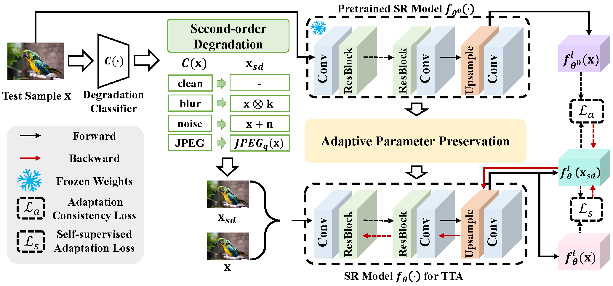

# Efficient Test-Time Adaptation for Super-Resolution with Second-Order Degradation and Reconstruction (NeurIPS, 2023)

This repository is the official PyTorch implementation of SRTTA with application to image super-resolution in test-time environment ([arXiv](https://arxiv.org/abs/2310.19011)).

---
>Image super-resolution (SR) aims to learn a mapping from low-resolution (LR) to high-resolution (HR) using paired HR-LR training images. 
Conventional SR methods typically gather the paired training data by synthesizing LR images from HR images using a predetermined degradation model, e.g., Bicubic down-sampling.
However, the realistic degradation type of test images may mismatch with the training-time degradation type 
due to the dynamic changes of the real-world scenarios, 
resulting in inferior-quality SR images.
To address this, existing methods attempt to estimate the degradation model and train an image-specific model, which, however, is quite time-consuming and impracticable to handle rapidly changing domain shifts.
Moreover, these methods largely concentrate on the estimation of one degradation type (e.g., blur degradation), overlooking other degradation types like noise and JPEG in real-world test-time scenarios, thus limiting their practicality.
To tackle these problems, we present an efficient test-time adaptation framework for SR, named SRTTA, which is able to quickly adapt SR models to test domains with different/unknown degradation types.
Specifically, we design a second-order degradation scheme to construct paired data based on the degradation type of the test image, which is predicted by a pre-trained degradation classifier.
Then, we adapt the SR model by implementing feature-level reconstruction learning from the initial test image to its second-order degraded counterparts, which helps the SR model generate plausible HR images.
Extensive experiments are conducted on newly synthesized corrupted DIV2K datasets with 8 different degradations and several real-world datasets, demonstrating that our SRTTA framework achieves an impressive improvement over existing methods with satisfying speed.
>

## Requirements
* Python 3.8, Pytorch 1.10
* More details (See [requirements.txt](requirements.txt))

## Datasets
Download the dataset from the following links and put them in ./datasets.

* BaiduYun : https://pan.baidu.com/s/1dJL941VJDo5nwXv5CEQzbQ (code:08v7) 

* GoogleDrive : https://drive.google.com/drive/folders/1lC9h4DdP3wrKIDRAMYUHPW-GFOMBbdxx?usp=drive_link

## Adapted checkpoints
We provide adapted checkpoints to reproduce the results of the paper. You can download from the following links.

* BaiduYun : https://pan.baidu.com/s/1IWKguxWE2KX7Wa1tKITZrA (code:6w14)

* GoogleDrive : https://drive.google.com/drive/folders/1ks1rlb0HvBQRGeLLyDeLkIOdE8tKcCWS?usp=drive_link

## Evaluation on Adapted models
Download the checkpoints from the above links and put them in src/checkpoints, then run the following commands.

```shell
cd src
bash scripts/test_checkpoints.sh
```

## Run test-time adaptation on DIV2K-C and DIV2K-MC
Download the pretrained models of EDSR (we also provide them in the above links), then put them in src/checkpoints and run the commands below.

```shell
# test-time adaptation on DIV2K-C
cd src
# for x2 scale
bash scripts/tta_div2kc_x2.sh
# for x4 scale
bash scripts/tta_div2kc_x4.sh

# test-time adaptation on DIV2K-MC
bash scripts/tta_div2kmc_x2.sh
```

## Citation
```bibtex
@inproceedings{
deng2023efficient,
title={Efficient Test-Time Adaptation for Super-Resolution with Second-Order Degradation and Reconstruction},
author={Zeshuai Deng and Zhuokun Chen and Shuaicheng Niu and Thomas H. Li and Bohan Zhuang and Mingkui Tan},
booktitle={Thirty-seventh Conference on Neural Information Processing Systems},
year={2023},
url={https://openreview.net/forum?id=IZRlMABK4l}
}
```

## Acknowledgement
The codes are based on [EDSR-PyTorch](https://github.com/sanghyun-son/EDSR-PyTorch). Thanks for their great efforts.